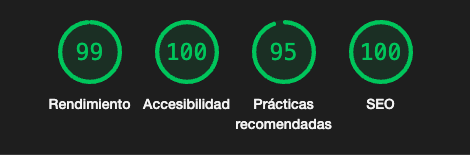

# 

Welcome to DevOverflow, a powerful platform for developers built with cutting-edge technologies. This project leverages Next.js 14, Tailwind CSS, TypeScript, MongoDB, Clerk, and Zod to create a seamless experience for users.

## Core Web Vitals

 

## Features

### Recommendation System
DevOverflow includes a sophisticated recommendation system for posts, ensuring users discover relevant content tailored to their interests.

### Global Database Data-fetching
Efficient global data-fetching capabilities ensure a seamless and responsive user experience across the platform.

### AI-generated Answers
Enhance user engagement with AI-generated answers to questions, providing quick and accurate responses to queries.

### Badge & Reputation System
Recognize and reward contributors with a badge and reputation system, fostering a sense of community and expertise.

### Views and Voting Mechanism
Engage users with a comprehensive views and voting mechanism, allowing the community to curate content.

### Filter and Pagination
Effortlessly navigate through content with filter and pagination options, enhancing the overall user experience.

### Integration of Third-party APIs
DevOverflow seamlessly integrates with third-party APIs to expand functionality and provide a comprehensive developer experience.

### Dark/Light Theme
Customize the platform's appearance with dark and light themes, catering to user preferences.

### Webhooks
Implement webhooks for real-time updates and notifications, ensuring users stay informed about relevant activities.

### Different Types of Data Fetching (SSG, ISR, SSR)
Optimize performance with different types of data fetching, including Static Site Generation (SSG), Incremental Static Regeneration (ISR), and Server-Side Rendering (SSR).

### SEO Optimization
Improve discoverability with robust SEO optimization, making DevOverflow easily accessible to search engines.

### Framer Motion
Enhance the user interface with smooth animations and transitions using Framer Motion.

### Full Responsive Design
DevOverflow is fully responsive, providing a consistent and enjoyable experience across various devices.

## Getting Started
To get started with DevOverflow, follow these steps:

1. Clone the repository.
2. Install dependencies using `npm install`.
3. Configure the necessary environment variables.
4. Run the development server with `npm run dev`.

Feel free to explore, contribute, and join our vibrant developer community on DevOverflow! If you have any questions or feedback, don't hesitate to reach out.
